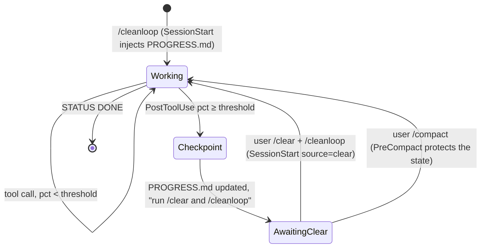

# Architecture

## The problem
A coding agent with a very full context degrades: it loses the initial instructions, repeats work, "forgets" decisions. Best practice is to keep the context small and persist state outside the conversation. But in Claude Code a **skill is just text**: it can neither measure the context window nor run `/clear`. Different components must cooperate.

## The three components

```mermaid
flowchart LR
  subgraph plugin[cleanloop plugin]
    S[Skill<br/>SKILL.md<br/><i>protocol</i>]
    H[Hooks<br/>hooks.json + scripts/<br/><i>measure, warn, guard</i>]
    R[Runner<br/>cleanloop.sh<br/><i>fresh-session loop</i>]
  end
  subgraph files[state in the project]
    T[TASK.md]
    P[PROGRESS.md]
    C[CLAUDE.md]
    ST[.cleanloop/]
  end
  S -- reads/writes --> P
  S -- durable facts --> C
  H -- injects --> S
  H -- last.json, markers --> ST
  R -- claude -p --plugin-dir --> H
  R -- STATUS/ITERATION --> P
  T --> S
```

| Component | Role | Constraint it solves |
|---|---|---|
| **Skill** (`skills/cleanloop/SKILL.md`) | Defines the *protocol*: how to checkpoint, how to resume, what goes into `PROGRESS.md` and what into `CLAUDE.md`. | The model knows what to do when asked. |
| **Hooks** (`hooks/hooks.json`, `scripts/*.sh`) | Measure the context at every tool call and inject the checkpoint instruction; re-inject state at startup; protect state during compaction; prevent an iteration from ending without a checkpoint. | The skill cannot measure: the harness does. |
| **Runner** (`scripts/cleanloop.sh`) | Runs `claude -p` in a loop, one new session per iteration, with stop conditions. | The skill cannot run `/clear`: cleaning is a new process. |

## How the context is measured
Every hook receives `transcript_path` (the session JSONL). The last `assistant` message carries `message.usage`; the tokens in context at the time of the call are:

```
used = input_tokens + cache_creation_input_tokens + cache_read_input_tokens
pct  = used / context_window * 100
```
The window is `CLEANLOOP_CONTEXT_WINDOW` if set, otherwise 1M when the model in `~/.claude/settings.json` contains `[1m]`, otherwise 200k. It is the same quantity the status line receives as `context_window.used_percentage`, but computed from the transcript because in `-p` mode the status line does not run.

## Flow of an iteration in loop mode

```mermaid
sequenceDiagram
  participant U as cleanloop.sh
  participant CC as claude -p (new process)
  participant SS as SessionStart hook
  participant M as model
  participant PG as PostToolUse hook
  participant SG as Stop hook
  U->>U: STATUS is DONE/BLOCKED? → exit
  U->>U: checksum(PROGRESS.md) before
  U->>CC: --plugin-dir, --append-system-prompt-file, --autocompact, prompt "iteration i"
  CC->>SS: source=startup
  SS-->>M: additionalContext = rules + TASK.md + PROGRESS.md; store initial checksum
  loop every tool call
    M->>PG: (transcript_path)
    PG->>PG: pct = usage / window
    alt pct ≥ HARD (once)
      PG-->>M: "STOP NOW: checkpoint and end the turn"
    else pct ≥ THRESHOLD (once, then reminders)
      PG-->>M: "close the sub-task, checkpoint, end the turn"
    end
  end
  M->>SG: end of turn
  alt PROGRESS.md unchanged
    SG-->>M: decision=block, "update PROGRESS.md" (only once)
  else modified
    SG-->>CC: ok
  end
  CC-->>U: exit
  U->>U: checksum after → progress or stall++
```

## Flow in an interactive session



## Design decisions

**Fresh session instead of compaction.** `/compact` produces a summary written by the model: opaque, unverifiable, and the context is never truly clean. A new `claude -p` process that re-reads `PROGRESS.md` is deterministic and inspectable (the file *is* the summary). Compaction remains only as a safety net (`--autocompact` beyond the hard threshold, `PreCompact` protecting the state).

**State in files, with a fixed format.** `PROGRESS.md` has mandatory sections and a length limit (~40 lines) because it is re-injected in full at every iteration: if it grew, it would eat the very context budget we want to protect. `CLAUDE.md` receives only durable facts for the same reason (it is loaded in *every* session).

**Hooks inert by default.** The plugin is installed at user level but acts only where `.cleanloop/enabled` exists (or `CLEANLOOP_ACTIVE=1`): no side effects in other projects, activation cost ~220 tokens per session.

**Soft threshold + hard threshold + reminders.** A single warning can be ignored "because it's almost done". The soft (close the sub-task) / hard (stop) / periodic reminder pattern is the structure of good backpressure: gradual, but with a limit.

**Stop hook only in loop mode.** Blocking the end of turn in an interactive session would be intrusive; in `-p` it is the only guarantee that an iteration produces a checkpoint. It blocks only once (`stop_hook_active`) so it can never wedge the loop.

**Checksum comparison, not mtime.** The runner and the Stop hook detect progress by hashing `PROGRESS.md`: a `touch` does not count, and one-second mtime resolution cannot cause false negatives.

**Loop guards.** Stall (N iterations without changes), maximum iterations, per-iteration budget, explicit `BLOCKED`: an autonomous loop must be able to fail cleanly, not spin forever.

## Known limitations
- The context measurement is as of the previous tool call: between two tool calls the model can generate long text the hook does not see.
- The percentage depends on the declared window: if the loop model has a different window than the one in `settings.json`, set `CLEANLOOP_CONTEXT_WINDOW`.
- In interactive mode the `/clear` step is manual (platform limitation).
- `bash`, `jq`, `md5`/`md5sum` are required; tested on macOS, expected to work on Linux.
