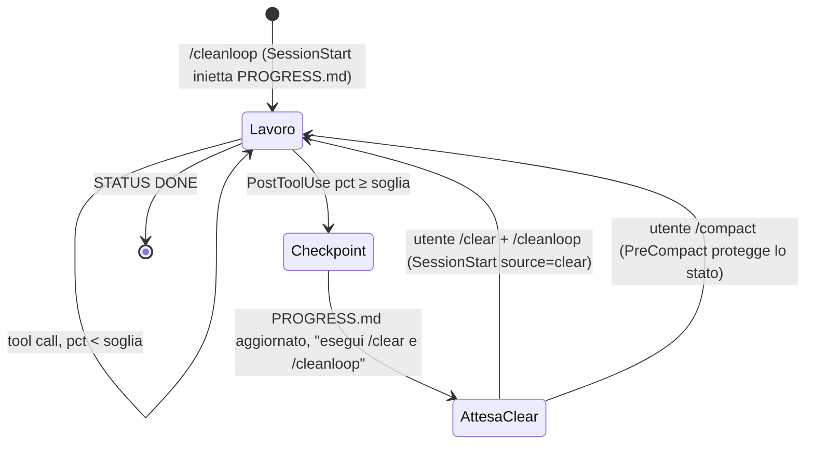

# Architettura

## Il problema
Un agente di coding con contesto molto pieno degrada: perde le istruzioni iniziali, ripete lavoro, "dimentica" decisioni. La best practice è tenere il contesto piccolo e persistere lo stato fuori dalla conversazione. Ma in Claude Code una **skill è solo testo**: non può misurare la finestra di contesto né eseguire `/clear`. Servono componenti diversi che collaborano.

## I tre componenti

```mermaid
flowchart LR
  subgraph plugin[plugin cleanloop]
    S[Skill<br/>SKILL.md<br/><i>protocollo</i>]
    H[Hook<br/>hooks.json + scripts/<br/><i>misura, avvisa, guarda</i>]
    R[Runner<br/>cleanloop.sh<br/><i>loop a sessioni fresche</i>]
  end
  subgraph files[stato nel progetto]
    T[TASK.md]
    P[PROGRESS.md]
    C[CLAUDE.md]
    ST[.cleanloop/]
  end
  S -- legge/scrive --> P
  S -- fatti durevoli --> C
  H -- inietta --> S
  H -- last.json, marker --> ST
  R -- claude -p --plugin-dir --> H
  R -- STATUS/ITERATION --> P
  T --> S
```

| Componente | Ruolo | Vincolo che risolve |
|---|---|---|
| **Skill** (`skills/cleanloop/SKILL.md`) | Definisce il *protocollo*: come si fa un checkpoint, come si riprende, cosa va in `PROGRESS.md` e cosa in `CLAUDE.md`. | Il modello sa cosa fare quando gli viene chiesto. |
| **Hook** (`hooks/hooks.json`, `scripts/*.sh`) | Misurano il contesto a ogni tool call e iniettano l'istruzione di checkpoint; reiniettano lo stato all'avvio; proteggono lo stato in compattazione; impediscono di chiudere un'iterazione senza checkpoint. | La skill non può misurare: lo fa l'harness. |
| **Runner** (`scripts/cleanloop.sh`) | Esegue `claude -p` in loop, una sessione nuova per iterazione, con condizioni di stop. | La skill non può eseguire `/clear`: la pulizia è un nuovo processo. |

## Come si misura il contesto
Ogni hook riceve `transcript_path` (il JSONL della sessione). L'ultimo messaggio di tipo `assistant` contiene `message.usage`; i token in contesto al momento della chiamata sono:

```
used = input_tokens + cache_creation_input_tokens + cache_read_input_tokens
pct  = used / context_window * 100
```
La finestra è `CLEANLOOP_CONTEXT_WINDOW` se impostata, altrimenti 200k se il modello (`CLEANLOOP_MODEL`, o in mancanza il modello globale in `~/.claude/settings.json`) contiene "haiku", altrimenti 1M — tutti i modelli Claude attuali hanno 1M di contesto standard tranne Haiku. **`used` è verificato empiricamente identico** a quello che la statusline riceve come `context_window` (stessa formula, stesso transcript); **la finestra invece no**: l'hook `PostToolUse` non riceve mai il campo `context_window` di Claude Code (verificato instrumentando dal vivo lo script in esecuzione), quindi cleanloop non può leggere la finestra reale e deve dedurla dal nome del modello.

## Flusso di un'iterazione in modalità loop

```mermaid
sequenceDiagram
  participant U as cleanloop.sh
  participant CC as claude -p (nuovo processo)
  participant SS as SessionStart hook
  participant M as modello
  participant PG as PostToolUse hook
  participant SG as Stop hook
  U->>U: STATUS è DONE/BLOCKED? → esci
  U->>U: checksum(PROGRESS.md) prima
  U->>CC: --plugin-dir, --append-system-prompt-file, --autocompact, prompt "iterazione i"
  CC->>SS: source=startup
  SS-->>M: additionalContext = regole + TASK.md + PROGRESS.md; salva checksum iniziale
  loop ogni tool call
    M->>PG: (transcript_path)
    PG->>PG: pct = usage / window
    alt pct ≥ HARD (una volta)
      PG-->>M: "FERMATI ORA: checkpoint e termina"
    else pct ≥ THRESHOLD (una volta, poi promemoria)
      PG-->>M: "chiudi il sotto-task, checkpoint, termina"
    end
  end
  M->>SG: fine turno
  alt PROGRESS.md invariato
    SG-->>M: decision=block, "aggiorna PROGRESS.md" (una sola volta)
  else modificato
    SG-->>CC: ok
  end
  CC-->>U: exit
  U->>U: checksum dopo → progresso o stallo++
```

## Flusso in sessione interattiva



## Decisioni di design

**Fresh session invece di compattazione.** `/compact` produce un riassunto scritto dal modello: opaco, non verificabile, e il contesto non è mai davvero pulito. Un nuovo processo `claude -p` che rilegge `PROGRESS.md` è deterministico e ispezionabile (il file *è* il riassunto). La compattazione resta solo come rete di sicurezza (`--autocompact` oltre la soglia dura, `PreCompact` che protegge lo stato).

**Stato nei file, con un formato fisso.** `PROGRESS.md` ha sezioni obbligatorie e un limite di lunghezza (~40 righe) perché viene reiniettato integralmente a ogni iterazione: se crescesse, mangerebbe il budget di contesto che si vuole proteggere. `CLAUDE.md` riceve solo fatti durevoli per lo stesso motivo (viene caricato in *ogni* sessione).

**Hook inerti per default.** Il plugin è installato a livello utente ma agisce solo dove esiste `.cleanloop/enabled` (o `CLEANLOOP_ACTIVE=1`): nessun effetto collaterale negli altri progetti, costo di attivazione ~220 token per sessione.

**Soglia morbida + soglia dura + promemoria.** Un unico avviso può essere ignorato "perché manca poco". Il pattern morbida (chiudi il sotto-task) / dura (fermati) / promemoria periodico è la stessa struttura di un buon backpressure: graduale, ma con un limite.

**Stop hook solo in loop.** In sessione interattiva bloccare la fine turno sarebbe invadente; in `-p` è l'unica garanzia che un'iterazione produca un checkpoint. Blocca una sola volta (`stop_hook_active`) per non incastrare mai il loop.

**Confronto per checksum, non per mtime.** Il runner e lo Stop hook rilevano il progresso confrontando l'hash di `PROGRESS.md`: un `touch` non conta, la risoluzione al secondo dell'mtime non crea falsi negativi.

**Guardie del loop.** Stallo (N iterazioni senza modifiche), massimo iterazioni, budget per iterazione, `BLOCKED` esplicito: un loop autonomo deve poter fallire in modo pulito, non girare all'infinito.

**Subagenti solo a livello di prompt, non di processo.** `CLEANLOOP_USE_SUBAGENTS` istruisce l'iterazione a usare l'Agent tool nativo per i task indipendenti, ma resta **un solo processo `claude -p` per iterazione**: niente orchestrazione di più processi paralleli dal runner. Più processi che scrivono `PROGRESS.md`/file del repo contemporaneamente romperebbero il modello "stato nei file" su cui si basa tutto lo strumento (race condition, checksum inconsistenti); un singolo turno che lancia e attende sub-agenti resta deterministico e compatibile col resto dell'architettura. La visibilità (quale subagente fa cosa) viene da `--forward-subagent-text` più il tagging in `stream_pretty`, non da un componente nuovo.

**Brief invece di task strutturati.** Il wizard interattivo si rompe su testo incollato con a capi/punti (limite di `read` in un prompt TTY). La modalità brief (`--brief`, `BRIEF.md`, stdin non interattivo) aggira il problema spostando l'interpretazione dal terminale al modello: il testo grezzo va in `BRIEF.md`, e la **prima iterazione** — non `init`, che è puro bash e non ragiona — lo legge e produce la coda strutturata in `TASK.md`. Coerente con "fresh session invece di compattazione": anche la pianificazione iniziale passa per un processo `claude -p` che scrive file, non per euristiche di parsing nello script.

## Limiti noti
- La misura del contesto è aggiornata alla tool call precedente: tra due tool call il modello può generare testo lungo senza che l'hook lo veda.
- La percentuale dipende dalla finestra dichiarata: se il modello del loop ha una finestra diversa da quella in `settings.json`, va impostata `CLEANLOOP_CONTEXT_WINDOW`.
- In interattivo il passaggio `/clear` è manuale (limite della piattaforma).
- `bash`, `jq`, `md5`/`md5sum` sono richiesti; testato su macOS, atteso funzionante su Linux.
